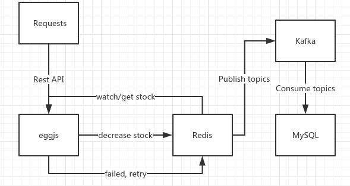

# Node study
This project is to verify second kill technique with [Nodejs](https://nodejs.org/), [Eggjs](https://eggjs.org/), [Apache Kafka](https://kafka.apache.org/), [Redis](https://redis.io/) and [MySQL](https://www.mysql.com/)

## What we are building
A sample [Nodejs](https://nodejs.org/) project implements second kill scenario, which means high concurrency buying in a very short time. 

This project is based on [Nodejs](https://nodejs.org/), using [Eggjs](https://eggjs.org/) as main framework, [Redis](https://redis.io/) as buffer layer, [MySQL](https://www.mysql.com/) as persistent layer and [Apache Kafka](https://kafka.apache.org/) as message bus through Redis and MySQL.

## Key Enablements 

* [Nodejs](https://nodejs.org/)
* [Eggjs](https://eggjs.org/)
* [Apache Kafka](https://kafka.apache.org/)
* [Redis](https://redis.io/)
* [MySQL](https://www.mysql.com/)

## Overall Architecture



## QuickStart
```bash
* docker-compose up -d
$ npm i
$ npm run dev
$ open http://localhost:7001/
```

## Installation Dependencies Check

* [docker-ce](https://www.docker.com/community-edition#/download)

* [docker-compose](https://docs.docker.com/compose/install/)

* [npm](https://www.npmjs.com/)

## Data initialization
* Change hosts and port of [configuration](https://github.com/terrencewei/node-study/blob/2-egg/config/config.default.js)
* Initialize Kafka
    ```bash
    $ # go into kafka docker container
    $ # e.g. docker exec -it node-study_kafka_1 bash
    $ kafka-topics.sh --create --zookeeper <docker host ip>:<docker-compose.yml.services.zookeeper.ports> --replication-factor 1 --partitions 1 --topic <app.config.service.producer.topics[0].topic>
    $ kafka-topics.sh --list --zookeeper <docker host ip>:<docker-compose.yml.services.zookeeper.ports>
    ```
* Initialize Redis
    ```bash
    $ # go into redis docker container
    $ # e.g. docker exec -it node-study_redis_1 bash
    $ redis-cli
    $ set counter <app.config.service.redis.stock.key>
    ```
 * Initialize MySQL
     ```bash
     $ # go into mysql docker container
     $ # e.g. docker exec -it node-study_mysql_1 bash
     $ mysql -u<app.config.mysql.client.user> -p<app.config.mysql.client.password>;
     $ create database <app.config.mysql.client.database>;
     $ use <app.config.mysql.client.database>;
     $ create table <app.config.service.mysql.stock.table> (
           id INT NOT NULL AUTO_INCREMENT,
           date timestamp,
           PRIMARY KEY ( id )
        );
     ```

## Technique Compatibilities

* Framework
    * Nodejs
    * Eggjs
* Message bus
    * Kafka
* Database
    * Redis
    * MYSQL

## Rest API

### /seckill/init
Initialize the stock in databases

### /seckill/buy
Buy one product, decrease one stock

### /seckill/get
Query available stock

## Service Configuration

These are service layer configurations, to handle business logic and config.

All the keys are started with `app.config.service.`

### Redis

* redis.stock.key: redis key to presents stock, default is 'counter'
* redis.stock.total: total available stock count, default is '100'

### MySQL

* mysql.stock.table: purchase record table, presents how many products had been purchased 

### Kafka
* producer.topics: producer topics
* consumer.topics: consumer topics
* consumer.options: consumer options

### More
see [config](https://github.com/terrencewei/node-study/blob/2-egg/config/config.default.js) for more details

## Development

### Code format
```bash
$ npm run lint -- --fix
```

### Test

#### Only run test
```bash
$ npm run test-local
```

#### Format code and run test
```bash
$ npm test
```

## TODO list
- [ ] Test codes about app/service
- [ ] Business improvement of app/service/seckill.js
- [ ] Error handing of rest API
- [ ] More comments